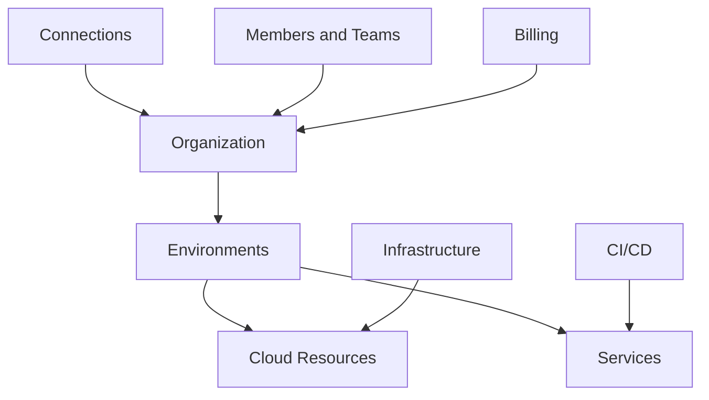

# Platform Overview

Planton turns your own cloud account into a self-service platform. AI designs the infrastructure, verifies the cost and permissions before anything is created, and publishes it as templates your whole team can deploy. Your services then ship onto that infrastructure straight from Git. It deploys to your own cloud accounts (AWS, GCP, Azure, Kubernetes) while managing the workflow, governance, and operational complexity.

The platform is organized around a clear resource hierarchy and a set of interconnected components.

## Platform Architecture

## Core Components

### Resource Hierarchy

**Organization > Environments > Resources**

Everything starts with your organization, branches into environments (dev, staging, prod), and contains your deployed resources. This mirrors the organization/project model used by major cloud providers.

### Connections

Secure, reusable integrations with external services. Connect your AWS credentials, GitHub repositories, Docker registries, or Kubernetes clusters once and use them across environments.

[Learn about Connections](/docs/connections)

### Infrastructure

Declarative infrastructure provisioning. Browse a catalog of deployment components, compose them into Infra Charts, and deploy with automated Stack Job execution using Pulumi, Terraform, or OpenTofu.

[Explore Infrastructure](/docs/infrastructure)

### CI/CD

Application CI/CD from Git to production. Connect a repository, push code, and get automated builds and deployments with real-time log streaming.

[Explore CI/CD](/docs/ci-cd)

### Teams and Access

Invite team members, organize them into teams, and manage permissions. Role-based access control at the organization and environment level.

[Manage teams and access](/docs/teams-and-access)

### Billing

Seat-based pricing — automation is never metered for billing, and AI runs on prepaid credits.

[View billing details](/docs/teams-and-access/billing)

## The Developer Journey

### Day 1: Getting Started

1. Sign up with email or Google account
2. Create your organization
3. Connect your cloud account (AWS, GCP, or Azure)
4. Create your first environment (dev, staging, or prod)

<!-- SCREENSHOT: Platform signup flow
  Page: /signup
  Action: Show the signup page with login options
  Focus: Full page
  Alt: Planton signup page showing email and Google login options
-->

### Day 2: First Infrastructure

1. Browse the deployment component catalog
2. Deploy a database or other resource
3. Watch the deployment progress in real-time
4. Access your resource

<!-- SCREENSHOT: Deployment component catalog
  Page: /infra-hub/deployment-components
  Action: Show the component catalog with search and filters
  Focus: Component grid with provider filters
  Alt: Deployment component catalog showing cloud resources filterable by provider
-->

### Day 3: First Application

1. Connect GitHub or GitLab with OAuth
2. Create a Service from your repository
3. Push code and watch it build
4. Get your live URL

### Week 2: Team Collaboration

1. Invite team members via email
2. Create teams for different projects
3. Set up staging and production environments
4. Configure approval workflows for production

## Key Platform Features

### Context-Aware Navigation

The context selector (top-left, next to logo) shows your current position in the resource hierarchy:

- **Organization Level**: Manage connections, billing, teams
- **Environment Level**: Deploy resources, view services

<!-- SCREENSHOT: Context selector
  Page: /dashboard
  Action: Show the context selector dropdown expanded
  Focus: The dropdown showing organization/environment hierarchy
  Alt: Context selector dropdown showing organization and environment hierarchy
-->

### Unified Deployment Experience

Whether deploying infrastructure or applications:

- Same mental model (declare, deploy, manage)
- Same visibility (logs, status, history)
- Same governance (policies, approvals, audit)

### Visual Infrastructure Management

View your infrastructure as:

- **List View**: Traditional table of resources
- **Canvas View**: Visual graph showing relationships
- **DAG View**: Deployment dependencies and progress

<!-- SCREENSHOT: Infrastructure views
  Page: /infra-hub
  Action: Show the canvas view with resource relationships
  Focus: The DAG visualization panel
  Alt: Infrastructure canvas view showing resource relationships and deployment dependencies
-->

## Getting Started

- [Platform Tour](/docs/platform/platform-tour) — Interactive walkthrough of all features
- [Quick Start Guide](/docs/platform/getting-started) — From signup to first deployment
- [Resource Hierarchy](/docs/platform/resource-hierarchy) — Deep dive into organizations and environments
- [Core Concepts](/docs/platform/core-concepts) — Understand the building blocks

## Platform Sections

- [Connections](/docs/connections) — Credential and integration management
- [Infrastructure](/docs/infrastructure) — Infrastructure provisioning and management
- [CI/CD](/docs/ci-cd) — Application deployment and CI/CD
- [Operations](/docs/operations) — Runtime operations
- [Runner](/docs/runner) — Secure execution agent
- [Security](/docs/security) — Credential isolation, encryption, authorization, and audit
- [Teams and Access](/docs/teams-and-access) — Collaboration and permissions
