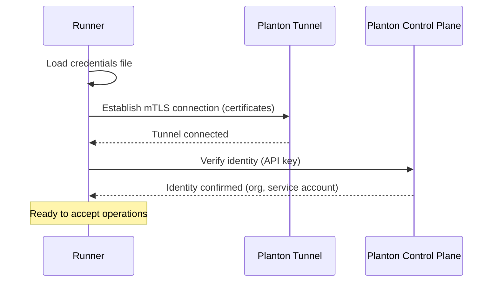

# Security Model

Runner's security model is built around a single principle: your cloud credentials never need to leave your infrastructure. Everything else — the mTLS certificate chain, the identity enforcement, the authentication modes — exists to make that principle work in practice while giving you flexibility in how you achieve it.

## Credential Isolation

When Planton needs to create a VPC, list Kubernetes pods, or query an S3 bucket, it does not call the cloud API directly. It sends the request to a runner deployed in your infrastructure, and the runner executes it using credentials it holds locally. The credentials — AWS access keys, GCP service account keys, Azure client secrets, kubeconfig files — remain where you put them.

This is not an incremental improvement over traditional credential sharing. It is a fundamentally different trust model:

| Aspect | Traditional SaaS | Runner Model |
|--------|-----------------|-------------|
| Where credentials are stored | Encrypted in the SaaS vendor's database | In your infrastructure — never transmitted to Planton |
| What the vendor can access | Your credentials, at rest and in transit | Only operational results (pod lists, deployment logs, resource status) |
| Credential rotation scope | Rotate in the vendor, then in your cloud | Rotate in your cloud only — the runner picks up changes automatically |
| Blast radius of a vendor breach | Attacker gains your cloud credentials | Attacker gains no credentials — they only see operational metadata |

The strongest form of this isolation is [runner-delegated authentication](#runner-delegated-authentication), where the runner uses its own cloud identity (IRSA, Workload Identity, Managed Identity) and no credential material is stored anywhere — not in Planton, not in a secrets manager, not in a config file.

## Runner Identity

Each runner has a dedicated machine identity on the Planton platform, represented by a [service account](/docs/security/authentication-and-authorization#service-accounts). When you [generate credentials](/docs/runner/deployment) for a runner, Planton auto-provisions a service account, mints an API key, and embeds the key in the runner's credentials file. The runner uses this key to authenticate with Planton's control plane at startup and during runtime operations.

This identity enables just-in-time credential resolution. Instead of embedding cloud provider secrets or state backend passwords in the runner's configuration, the runner fetches them from Planton's secrets manager at the moment they are needed. The service account's permissions control what the runner can access — scoped to its owning organization's secrets and variables.

### Startup Authentication

When the runner starts, it performs two authentication steps before accepting any operations:

1. **Tunnel authentication** — The runner establishes a secure mutual TLS connection using the certificates in the credentials file. This authenticates the runner's tunnel identity.
2. **Control-plane authentication** — The runner calls the control plane using the embedded API key to verify its service account identity. If this verification fails (expired key, revoked credentials, misconfigured permissions), the runner refuses to start.

This two-phase approach means a misconfigured runner fails immediately at startup rather than encountering cryptic errors when the first operation tries to resolve a secret.

### Identity Scope

The runner's service account is scoped to the organization that registered it. The service account receives `viewer` access on the organization, which cascades through the permission hierarchy to secrets and variables. This means the runner can resolve any secret or variable in its organization but cannot access resources in other organizations.

## Mutual TLS Authentication

Every runner authenticates with Planton's control plane using mutual TLS. During [credential generation](/docs/runner/deployment), Planton generates a certificate bundle:

| Certificate | Purpose | Who Holds It |
|------------|---------|-------------|
| **CA certificate** | Establishes the root of trust. Both the control plane and the runner use it to verify each other's certificates. | Planton (server-side) and the runner (client-side) |
| **Runner certificate** | The runner's identity. Contains a unique identifier bound to the runner's organization. Presented to the control plane during the TLS handshake. | The runner only |
| **Runner private key** | Proves the runner possesses the identity certificate. Used to complete the mTLS handshake. | The runner only — Planton does not retain the private key after generation |

When the runner connects to the control plane:

1. The runner presents its certificate.
2. The control plane verifies the certificate was issued by the known CA.
3. The control plane validates the runner's identity matches its organization.
4. The control plane presents its own certificate.
5. The runner verifies the control plane's certificate against the CA.

Both sides are authenticated. A man-in-the-middle attack would require compromising the CA private key, which is stored securely in Planton's backend and never exposed.

## Credential Lifecycle

### Minting

A runner's credentials are minted server-side when the runner enrolls — a runner started with a runner token registers itself and receives its identity document: the mTLS certificates (CA, runner certificate, runner private key), an API key for its auto-provisioned service account, the control-plane endpoint, and organizational context, in a single JSON document delivered only to the runner. The private key and API key are returned once — Planton does not store them in any database or cache. Every mint revokes the runner's previous API keys, so one runner holds exactly one live key at all times.

### Storage

You are responsible for storing credentials securely. For production deployments, store credentials using your target platform's secrets management:

- **Kubernetes**: Store as a Kubernetes Secret, referenced by the runner's Deployment
- **AWS ECS**: Store in AWS Secrets Manager, injected into the ECS task definition
- **GCP Cloud Run**: Store in GCP Secret Manager, mounted as environment variables
- **Azure Container Apps**: Store in Azure Key Vault, referenced by the Container App

### Rotation

Re-enrolling IS rotating: when a runner enrolls again under its admitting token, it receives fresh certificates and a fresh API key, and all previous API keys for its service account are revoked in the same act. There is no separate rotation command and no human handling of credential material — rotation happens at the runner, never in a browser or clipboard.

If a runner's identity AND its admitting token are both compromised, revoke the token, reset the runner's enrollment from its detail page (an audited action that revokes its identity and clears its token lineage), and let the runner re-enroll with a new token. Old certificates and API keys are invalidated immediately on any re-mint — plan for a brief connectivity gap, or run a second runner before resetting the first.

## Authentication Modes

When a request reaches the runner, it needs credentials to authenticate with the target cloud provider (AWS, GCP, Azure, or Kubernetes). Planton supports three authentication modes, configured per [connection](/docs/connections):

### Inline Authentication

Credentials are stored in Planton (encrypted at rest) and passed to the runner as part of each request. The runner uses them to authenticate with the cloud API and discards them after the request completes.

**How it works:** Planton resolves the connection, retrieves the encrypted credentials, includes them in the request payload sent through the secure tunnel, and the runner extracts and uses them.

**Trade-off:** Simpler to set up — you provide credentials once during connection creation. But credentials traverse the tunnel (encrypted with mTLS) and are briefly held in the runner's memory during request execution.

**When to use:** Getting started quickly, or when the runner does not have its own cloud identity (e.g., running on a machine without IRSA or Workload Identity).

### Runner-Delegated Authentication

The runner uses its own cloud identity to authenticate — no credentials are passed through the tunnel at all. The runner relies on the identity mechanisms provided by its hosting environment:

| Hosting Environment | Identity Mechanism |
|--------------------|-------------------|
| AWS ECS / EKS | IAM Roles for Service Accounts (IRSA) or ECS Task Role |
| GCP GKE / Cloud Run | Workload Identity or attached service account |
| Azure AKS / Container Apps | Managed Identity (system-assigned or user-assigned) |
| Kubernetes (any) | In-cluster kubeconfig via the mounted service account |

**How it works:** The request includes only the instruction to use runner-delegated auth — no credential material. The runner authenticates with the cloud API using whatever identity its environment provides. Credentials exist only in the runner's hosting environment, managed by the cloud provider's IAM system.

**Trade-off:** Requires configuring the runner's hosting environment with the right IAM roles, Workload Identity bindings, or Managed Identity assignments. More setup, but the strongest security posture.

**When to use:** Production environments where credential isolation is a requirement. This is the recommended mode for enterprise deployments.

### Cross-Account Trust (AWS Only)

The runner uses AWS STS AssumeRole to access resources in a different AWS account. No long-lived credentials are stored — the runner uses its own IAM role to assume a role in the target account, receiving temporary credentials that expire automatically.

**How it works:** The connection specifies the target IAM role ARN. The runner uses its own identity (IRSA or ECS Task Role) to call `sts:AssumeRole`, receives temporary credentials, and uses those for the operation.

**Trade-off:** Requires cross-account IAM trust relationships. Most complex to set up, but eliminates long-lived credentials entirely while enabling multi-account access.

**When to use:** Organizations with multiple AWS accounts that want a single runner to operate across accounts without storing credentials for each one.

## Organization-Scoped Identity

Each runner's identity is scoped to the organization that registered it. This is enforced at two layers:

- **Tunnel layer** — The unique cryptographic identity embedded in the runner's mTLS certificate is bound to the organization during credential generation. The control plane validates that the runner's certificate matches the identity it claims before accepting the tunnel connection.
- **API layer** — The runner's service account is scoped to the organization. The control plane verifies this identity when the runner authenticates with its API key at startup.

This dual-layer enforcement means:

- A runner registered to **org A** cannot receive requests intended for **org B**, even if both runners connect to the same infrastructure.
- A runner cannot claim a different identity by modifying its configuration — the identity is bound to the certificate and the service account, both of which are signed and verified server-side.
- Revoking a runner's credentials (any re-enrollment, or an operator's enrollment reset) immediately prevents both the old certificate and API key from being accepted, even if the runner is still running with old credentials.

## What the Runner Cannot Do

The runner's capabilities are bounded by the credentials it has access to and the operations the platform supports:

- **No lateral movement.** The runner only calls cloud APIs it has explicit credentials or identity bindings for. Having a runner in a VPC does not give it access to other resources in that VPC — it needs IAM permissions like any other workload.
- **No data exfiltration path.** The secure tunnel only carries structured API requests and responses. There is no mechanism for the runner to upload arbitrary data to Planton.
- **No inbound access.** The runner does not expose any network services. It is not reachable from the network. All requests arrive through the authenticated tunnel connection initiated by the runner itself.

## Related Documentation

- [Runner Overview](/docs/runner) — What Runner is and why it exists
- [Deployment](/docs/runner/deployment) — Credential generation, storage, and rotation
- [Authentication and Authorization](/docs/security/authentication-and-authorization) — Service accounts, API keys, and the permission model
- [Connections: Cloud Providers](/docs/connections/cloud-providers) — Configuring authentication modes per connection
- [Security Overview](/docs/security) — Platform-wide security architecture and trust model
