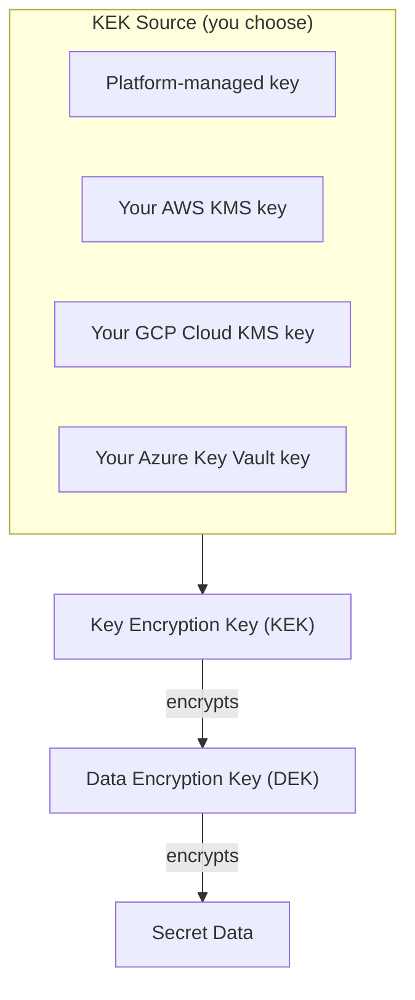

# Encryption

Every secret in Planton — regardless of which [backend](/docs/secrets/backends) stores it — is protected by envelope encryption. This is the same encryption pattern used by AWS S3, GCP Cloud Storage, Azure Blob Storage, and Snowflake. It is always on. There is no "disable encryption" toggle. You choose **who controls the encryption key** — not whether encryption happens.

## Envelope Encryption

Envelope encryption uses a two-tier key hierarchy:

1. **When you create a secret version**, Planton generates a random AES-256 encryption key (the Data Encryption Key, or DEK) unique to that version.
2. The DEK encrypts your secret data using AES-256-GCM authenticated encryption.
3. The DEK itself is then encrypted by a Key Encryption Key (KEK) — either platform-managed or your own cloud KMS key.
4. The encrypted data and the encrypted DEK are stored together in the backend. The plaintext DEK is discarded immediately.

**When you read a secret version**, the process reverses: the KEK decrypts the DEK, the DEK decrypts the data, and the plaintext is returned. The plaintext DEK exists in memory only for the duration of the decryption operation.

### Why This Matters

- **Every version has its own encryption key.** If a single DEK were ever compromised, only that one version would be affected — not every version of every secret.
- **Key rotation is automatic.** Because each version gets a fresh DEK, creating a new version of a secret is inherently a key rotation event. There are no rotation jobs to schedule.
- **Defense in depth.** Even if someone gains access to the backend storage directly (bypassing Planton), they see only ciphertext. Without the KEK, the encrypted DEKs cannot be unwrapped, and the secret data cannot be read.

## Zero-Trust Encryption

Planton's encryption model operates on a zero-trust principle: **the platform encrypts your data before it touches any storage system.** This means:

- The built-in backend stores only ciphertext — Planton's own database never contains plaintext secret values
- Custom backends (AWS Secrets Manager, Vault, etc.) also receive only ciphertext — their native encryption is an additional layer, not the only layer
- Even a full compromise of the backend storage yields nothing without the encryption keys

When combined with [Planton Runner](/docs/runner), the security boundary extends further. Secrets that are needed for infrastructure deployments or cloud operations are decrypted just-in-time only within the Runner — which runs in your infrastructure, not Planton's. The plaintext value is used for the operation and then discarded. Planton's own control plane never sees the decrypted secret.

## Customer-Managed Encryption Keys (CMEK)

By default, the platform manages the Key Encryption Key (KEK) for your organization. This is the default option — encryption works out of the box with no configuration.

For organizations that require cryptographic control over their own data — for compliance with SOC 2, HIPAA, FedRAMP, or internal security policies — Planton supports Customer-Managed Encryption Keys (CMEK).

With CMEK, you provide your own KEK from a cloud KMS service:

| KMS Provider | What You Provide |
|-------------|-----------------|
| **AWS KMS** | KMS key ARN (or alias), AWS region, access credentials |
| **GCP Cloud KMS** | CryptoKey resource name, service account key |
| **Azure Key Vault** | Vault URL, key name, key version (optional), service principal credentials |

### What CMEK Gives You

- **Cryptographic control.** You own the key that protects all other keys. Revoking your KMS key makes all secrets in that backend permanently unreadable — by anyone, including Planton.
- **Compliance evidence.** Auditors can verify that encryption keys are under your organization's control, not a third party's.
- **Break-glass recovery.** Because the encryption format is documented and deterministic, you can build your own decryption tool using your KMS key to recover secrets independently of Planton in a disaster scenario.

### How CMEK Is Configured

CMEK is configured per secret backend. When you create or update a backend, you specify the encryption key source:

- **Platform-managed** (default) — Planton handles everything. Zero configuration.
- **AWS KMS** — Provide your KMS key ARN and AWS credentials.
- **GCP Cloud KMS** — Provide your CryptoKey resource name and a service account key.
- **Azure Key Vault** — Provide your vault URL, key name, and service principal credentials.

The CMEK credentials are stored with the same security as backend connection credentials — encrypted and never exposed in plaintext.

## Choosing the Right Encryption Configuration

| Scenario | Encryption |
|----------|------------|
| **Getting started** | Platform-managed (default) |
| **Enterprise compliance** | CMEK with your cloud KMS |
| **Data residency requirements** | Platform-managed or CMEK |
| **Existing Vault infrastructure** | Platform-managed or CMEK |

Start with the defaults. Platform-managed encryption provides strong security with zero configuration. Add CMEK when compliance or policy requires your organization to control the encryption keys.

## Related Documentation

- [Secret Backends](/docs/secrets/backends) — Where secrets are stored
- [Managing Secrets](/docs/secrets/managing-secrets) — Creating and managing secrets
- [Runner: Security Model](/docs/runner/security-model) — How secrets are protected during execution
- [Security Overview](/docs/security) — Platform-wide security architecture
