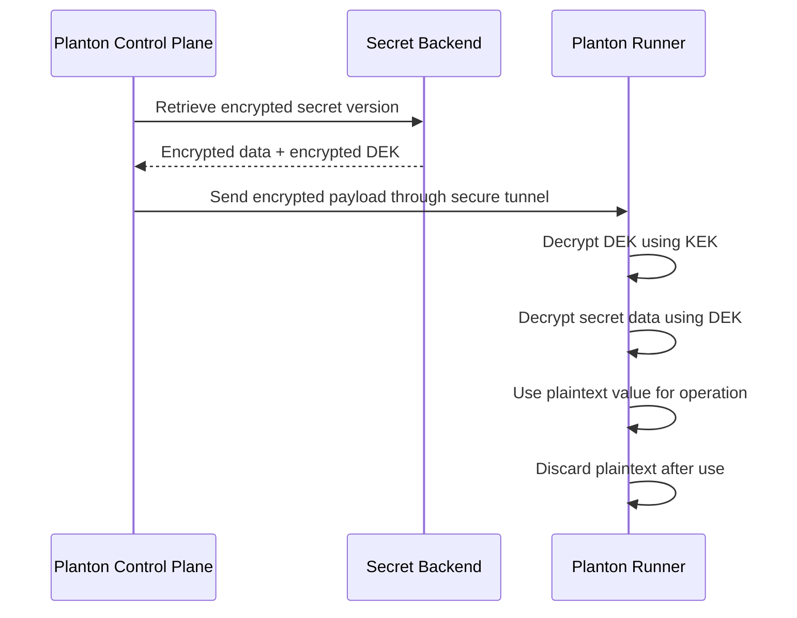

# Secrets

A secret in Planton is a named container for sensitive data — API keys, database passwords, service account tokens, private certificates, or any value that should never appear in plaintext in a database, log file, or configuration repository. Secrets are scoped to an organization or a specific environment, versioned immutably, and encrypted before they touch any storage system.

If you have used GitHub Organization Secrets, GitLab CI/CD Variables (protected), or AWS Secrets Manager, the model is familiar. Planton adds envelope encryption with customer-managed key support, immutable versioning, and just-in-time decryption within your own infrastructure.

## Why Secrets Exist

In a typical DevOps setup, sensitive values end up scattered across the stack. AWS keys live in CI/CD environment variables. Database passwords are hardcoded in Kubernetes Secrets. API tokens are duplicated across repositories. When someone rotates a credential, they have to track down every place it was used — and hope they did not miss one.

Planton's Secrets Manager gives sensitive values a single, secure home. You create a secret once, scope it to the right environments, and reference it from services and infrastructure deployments. The platform handles encryption, versioning, and just-in-time delivery. Engineers consuming the secret never see the underlying value — they reference it by name, and the platform resolves it at runtime.

## Scoping: Organization vs Environment

Every secret has a scope that determines where it is available:

**Organization secrets** are available across all environments in your organization. Use these for values that do not change between environments — a third-party API key, a shared monitoring token, or a license key.

**Environment secrets** are specific to a single environment. Use these for values that differ between environments — the production database password, the staging API endpoint, or an environment-specific service account.

The scoping model mirrors how teams naturally think about configuration: some things are global, others are environment-specific. When a service references a secret, Planton resolves it within the appropriate scope.

## Creating a Secret

### Using the Web Console

Navigate to **Secrets** in the sidebar. Click **Create Secret** and provide:

- **Name** — A human-readable identifier (e.g., `stripe-api-key`, `production-db-password`). This becomes the secret's slug, used for referencing it throughout the platform.
- **Scope** — Organization (available everywhere) or Environment (specific to one environment).
- **Description** — What this secret contains and what it is used for. Future engineers will thank you.
- **Backend** — Which [secret backend](/docs/secrets/encryption) stores this secret's versions. Leave empty to use the organization's default backend.

<!-- SCREENSHOT: Create secret form
  Page: /orgs/{org}/secrets (create dialog)
  Action: Show the secret creation form with name, scope, description, and backend fields
  Focus: The complete form with scope selection visible
  Alt: Secret creation form showing name field, scope selector (organization/environment), description field, and backend selector
-->

### Using the CLI

```bash
# List all secrets in the organization
planton service secrets

# Filter secrets by text
planton service secrets --filter "database"
```

The `upsert` command creates a new secret or updates an existing one through an interactive editor:

```bash
# Create or update a secret (opens interactive YAML editor)
planton service secrets upsert
```

## Secret Versions

Secret values are stored as **versions**. Each version is an immutable snapshot — once created, it cannot be modified. To change a secret's value, you create a new version. The previous versions remain available for audit and rollback.

This immutability is deliberate:

- **Audit trail.** Every change to a secret is a discrete event with a timestamp and the identity of who created it. There is no "someone changed the password, but we don't know when or what it was before."
- **Safe rollback.** If a new secret value breaks something, the previous version still exists. You can identify what changed and when.
- **Natural key rotation.** Because each version gets its own encryption key (see [envelope encryption](/docs/secrets/encryption#envelope-encryption)), creating a new version is inherently a cryptographic key rotation.

### Version Lifecycle

1. **Create** — Provide key-value pairs. Planton encrypts the data with a fresh AES-256 encryption key, encrypts that key with the backend's Key Encryption Key, and stores both in the backend. The plaintext encryption key is discarded immediately.
2. **Read** — Retrieve a specific version or the latest version. Decryption happens on demand — the stored data is ciphertext until you explicitly request it.
3. **List** — View all versions of a secret (metadata only — timestamps, version identifiers). Secret data is not included in list responses.
4. **Delete** — Remove a specific version. The encrypted data is deleted from the backend and the metadata is removed from Planton.

### Managing Versions via CLI

```bash
# Get the current value of a secret
planton service secrets get-value --group my-secrets --name API_KEY

# Create or update a secret value (opens interactive editor)
planton service secrets upsert

# Delete a secret entry
planton service secrets delete --group my-secrets --name API_KEY
```

## How Secrets Flow to Runtime

When a service deployment or infrastructure operation needs a secret, the following happens:



1. Planton's control plane retrieves the encrypted secret from the backend.
2. The encrypted payload is sent to the [Planton Runner](/docs/runner) through the authenticated secure tunnel.
3. The Runner — which runs in your infrastructure, not Planton's — decrypts the secret just-in-time using the appropriate encryption key.
4. The plaintext value is used for the operation (injected into a deployment, passed to a cloud API, etc.).
5. After the operation completes, the plaintext is discarded.

**The critical point: Planton's control plane never sees the decrypted secret.** The entire decryption and usage happens within the Runner, which runs in your infrastructure. This means:

- A compromise of Planton's control plane does not expose your secret values
- Planton engineers cannot read your secrets — they can only see encrypted ciphertext
- Your secrets exist in plaintext only within your own infrastructure, only for the duration of the operation

## Referencing Secrets from Services

Services in Service Hub reference secrets by name. During the deployment pipeline, Planton resolves the references and injects the values into the runtime environment.

The reference syntax uses the secret's group and name:

```
$secrets-group/<group-name>/<secret-name>
```

The CLI provides tools for working with resolved references:

```bash
# View resolved environment variables (includes secrets) for a service
planton service env-vars --env production

# Generate .env files for local development
planton service dot-env --env production

# Override specific values for local use
planton service dot-env --env production --set DATABASE_PASSWORD=localdev123
```

The `env-vars` command displays a table showing each variable and secret reference with its resolution status — whether it resolved successfully or encountered an error. The `dot-env` command writes `.env` and `.env_export` files to the current directory for running services locally with the same configuration as deployed environments.

## Future Platform Integrations

Secrets Manager is designed to become the universal source of truth for sensitive values across the entire Planton platform. The following integrations represent the platform's design direction:

**Connection fields** — Sensitive fields in [connections](/docs/connect) (such as AWS secret access keys, GCP service account keys, or Azure client secrets) will be stored as secret references rather than inline values. The connection stores a reference to the secret; the actual value lives in the Secrets Manager, encrypted and versioned.

**Cloud Resource inputs** — Any input field on a Cloud Resource that contains sensitive data will support secret references. Instead of storing a database password in plaintext as part of a resource definition, you store a reference to a secret. The value is resolved just-in-time before the deployment executes in the Runner.

**Sensitive outputs** — Infrastructure deployments often produce sensitive outputs (database connection strings, generated API keys, private endpoints). These will be automatically routed to the Secrets Manager instead of stored as plaintext in resource outputs.

These integrations are under active development. The specific details may evolve as the design matures, but the direction is clear: sensitive values belong in the Secrets Manager, not scattered across resource definitions and connection configurations.

## Related Documentation

- [Secret Backends](/docs/secrets/backends) — Where secrets are stored
- [Encryption](/docs/secrets/encryption) — Envelope encryption and customer-managed keys
- [Variables](/docs/variables) — Non-sensitive configuration management
- [Runner: Security Model](/docs/runner/security-model) — How the Runner protects secrets during execution
- [Connections](/docs/connections) — Managing connections where secrets will be referenced
