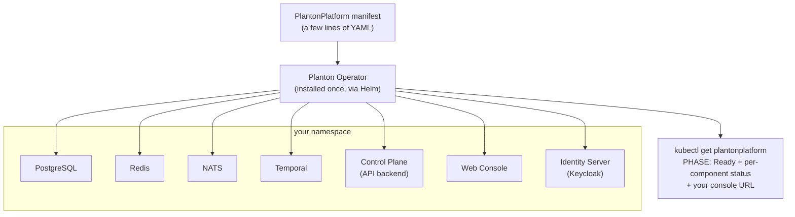

# Self-Hosting Planton

Planton runs on your own Kubernetes cluster. You install a Kubernetes operator with one Helm command, apply a manifest that is a few lines of YAML, and the operator deploys and manages the entire platform — database, cache, message bus, workflow engine, API backend, and web console — then reports the health of every piece back through the manifest's status.

> **Preview status.** The self-hosted platform is in active preview. Today's build installs, reaches `Ready`, serves the web console at your own URL, and — when ingress is enabled — deploys a bundled identity server so your team can sign in with no external identity setup. This page grows as each milestone lands.

## How It Works

The operator watches for a `PlantonPlatform` resource. When you apply one, it deploys every platform component into the manifest's namespace, wires them together, and keeps them converged. You never install or configure the individual components yourself.



Everything is public — the operator chart and all platform images pull anonymously. No account, no license key, no image pull secret.

## Prerequisites

- A Kubernetes cluster (v1.24+) with **amd64/x86_64 nodes** — check with `kubectl get nodes -o wide`
- A **default StorageClass** for persistent volumes — check with `kubectl get storageclass`
- Roughly **4–6 GB of schedulable memory** headroom
- `kubectl` with admin access to the cluster, and `helm` v3

## Install the Operator

```bash
helm install planton-operator oci://ghcr.io/plantonhq/charts/planton-operator \
  --version 0.2.0 \
  --namespace planton-operator-system --create-namespace
```

Wait for the operator pod to reach `1/1 Running`:

```bash
kubectl get pods -n planton-operator-system -w
```

## Deploy Planton

Create a namespace and apply a minimal `PlantonPlatform` manifest. The version is the only required field — storage sizes and optional components all have sensible defaults:

```bash
kubectl create namespace planton
```

```bash
cat <<'EOF' | kubectl apply -f -
apiVersion: planton.ai/v1
kind: PlantonPlatform
metadata:
  name: planton
  namespace: planton
spec:
  version: v0.0.33-selfhosted-preview
EOF
```

Watch the platform converge. The first boot takes several minutes: the API backend is a JVM service that provisions its own databases and runs schema migrations before it reports healthy.

```bash
kubectl get plantonplatform planton -n planton -w
```

```text
NAME      PHASE   VERSION                      URL   AGE
planton   Ready   v0.0.33-selfhosted-preview         8m
```

The `URL` column stays empty until you configure ingress (below).

Every component reports its own health with a plain-language message. If anything is stuck, this is the first place to look:

```bash
kubectl get plantonplatform planton -n planton -o jsonpath='{.status.components}' | jq
```

## Open the Console

Without any networking configuration, reach the console over a port-forward tunnel:

```bash
kubectl -n planton port-forward svc/planton-console 8080:80
```

Then open `http://localhost:8080`. The console loads in local single-user mode — multi-user sign-in deploys automatically when you enable ingress (below).

## Publish at Your Own URL

Instead of a tunnel, the operator can publish Planton through your cluster's ingress controller. This is a ladder — every rung works, and each line you add takes you one rung up:

1. **`enabled: true` alone** — the operator derives a working URL from your ingress controller's public address (no DNS setup) and serves plain HTTP. Meant for evaluation.
2. **Add `hostname`** — Planton is served at your own domain, plain HTTP.
3. **Add `tls.secretName`** — HTTPS with a certificate you bring (an existing `kubernetes.io/tls` Secret).
4. **Or add `tls.issuer`** — HTTPS with a certificate issued and renewed automatically by cert-manager, if your cluster runs it.

TLS requires a hostname (rungs 3 and 4 build on rung 2) — a certificate cannot be issued for an auto-derived address, and the API rejects the combination with a message that says so.

```yaml
apiVersion: planton.ai/v1
kind: PlantonPlatform
metadata:
  name: planton
  namespace: planton
spec:
  version: v0.0.33-selfhosted-preview
  ingress:
    enabled: true
    # hostname: planton.example.com    # rung 2: your own domain
    # ingressClassName: nginx          # omit to use the cluster default
    # tls:                             # rung 3: HTTPS, bring your own cert
    #   secretName: planton-tls
    # tls:                             # rung 4: HTTPS via cert-manager
    #   issuer:
    #     name: letsencrypt-prod
    #     kind: ClusterIssuer
```

One hostname serves both the console pages and the API calls the browser makes — there is no second endpoint to configure. The platform tells you its URL:

```bash
kubectl get plantonplatform planton -n planton
```

```text
NAME      PHASE   VERSION                      URL                                    AGE
planton   Ready   v0.0.33-selfhosted-preview   https://planton.example.com            9m
```

If the ingress is misconfigured — the named ingress class does not exist, there is no default class, the TLS Secret is missing, or cert-manager is not installed — the `ingress` entry in `status.components` explains exactly what is wrong and what to do, in plain language. You can also enable ingress later by editing the manifest of an already-running platform; the operator reconciles the change.

Enabling ingress also deploys the bundled identity server on the same hostname under `/idp` — a published platform is always authenticated. There is no separate identity configuration step.

## Sign In

Once ingress is enabled and the platform is `Ready`, open `<your URL>/login`. The first admin user's credentials are generated and stored in a Kubernetes Secret:

```bash
kubectl -n planton get secret planton-identity-admin-user \
  -o jsonpath='{.data.username}' | base64 -d; echo
kubectl -n planton get secret planton-identity-admin-user \
  -o jsonpath='{.data.password}' | base64 -d; echo
```

Keycloak forces a password change at first sign-in. After you sign in, the console provisions your Planton account automatically.

To add more users, use the identity server's admin console at `<your URL>/idp/admin`. Bootstrap admin credentials are in the Secret `planton-identity-bootstrap-admin` (username `admin`).

**Cluster prerequisite:** pods must be able to reach the platform's own public URL from inside the cluster (the API validates sign-in tokens against that address). Most clusters satisfy this; if yours does not, the `identity` entry in `status.components` explains the failure.

## If Something Is Stuck

```bash
kubectl describe plantonplatform planton -n planton
kubectl logs -n planton deploy/planton-control-plane --tail=200
kubectl get events -n planton --sort-by=.lastTimestamp | tail -30
```

The per-component status is designed to name the failing component and the reason before you need to read logs.

## Teardown

```bash
kubectl delete namespace planton
helm uninstall planton-operator -n planton-operator-system
kubectl delete namespace planton-operator-system
```

Deleting the namespace removes the platform and all its data. The `PlantonPlatform` custom resource definition stays installed even after the Helm release is uninstalled (Helm never deletes CRDs); remove it explicitly if you want a completely clean cluster:

```bash
kubectl delete crd plantonplatforms.planton.ai
```

## Related Documentation

- [Getting Started](/docs/getting-started) — the desktop app and CLI for deploying infrastructure from your machine
- [Architecture](/docs/concepts/architecture) — how the pieces of Planton fit together
- [Troubleshooting](/docs/troubleshooting) — solutions to common issues
