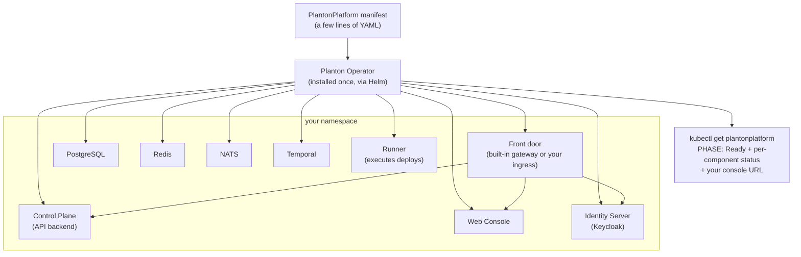

# Self-Hosting Planton

Planton runs on your own Kubernetes cluster. You install a Kubernetes operator with one Helm command, apply a manifest that is a few lines of YAML, and the operator deploys and manages the entire platform — database, cache, message bus, workflow engine, API backend, web console, a bundled identity server for sign-in, and a built-in runner that executes your infrastructure deployments — then reports the health of every piece back through the manifest's status.

> **Preview status.** The self-hosted platform is in active preview. Today's build installs, reaches `Ready`, gives your team multi-user sign-in with **zero networking setup** — one port-forward command opens a fully working, signed-in Planton — and **deploys real infrastructure** through a built-in runner that works out of the box. Publish it at your own URL with HTTPS whenever you are ready. This page grows as each milestone lands.

## How It Works

The operator watches for a `PlantonPlatform` resource. When you apply one, it deploys every platform component into the manifest's namespace, wires them together, and keeps them converged. You never install or configure the individual components yourself.

Every install has exactly one **front door** serving the console, the API, and sign-in on a single origin: a built-in gateway you reach over `kubectl port-forward` (the default — no networking required), or your cluster's ingress controller at your own hostname. Moving from one to the other is a manifest edit, not a re-architecture.



Everything is public — the operator chart and all platform images pull anonymously. No account, no license key, no image pull secret.

## Prerequisites

- A Kubernetes cluster (v1.24+) with **amd64/x86_64 nodes** — check with `kubectl get nodes -o wide`
- A **default StorageClass** for persistent volumes — check with `kubectl get storageclass`
- Roughly **4–6 GB of schedulable memory** headroom
- `kubectl` with admin access to the cluster, and `helm` v3

## Install the Operator

```bash
helm install planton-operator oci://ghcr.io/plantonhq/charts/planton-operator \
  --version 0.4.0 \
  --namespace planton-operator-system --create-namespace
```

Wait for the operator pod to reach `1/1 Running`:

```bash
kubectl get pods -n planton-operator-system -w
```

## Deploy Planton

Create a namespace and apply a minimal `PlantonPlatform` manifest. Set `adminEmail` to **your** email — the first admin is a real person, not a generic built-in account:

```bash
kubectl create namespace planton
```

```bash
cat <<'EOF' | kubectl apply -f -
apiVersion: planton.ai/v1
kind: PlantonPlatform
metadata:
  name: planton
  namespace: planton
spec:
  version: v0.0.35-selfhosted-preview
  identity:
    adminEmail: you@example.com
EOF
```

Watch the platform converge. The first boot takes several minutes: the API backend is a JVM service that provisions its own databases and runs schema migrations before it reports healthy.

```bash
kubectl get plantonplatform planton -n planton -w
```

```text
NAME      PHASE   VERSION                      URL                     AGE
planton   Ready   v0.0.35-selfhosted-preview   http://localhost:8080   8m
```

The `URL` column shows where your front door will answer — `http://localhost:8080` in port-forward mode, or your own hostname once you enable ingress (below).

Every component reports its own health with a plain-language message. If anything is stuck, this is the first place to look:

```bash
kubectl get plantonplatform planton -n planton -o jsonpath='{.status.components}' | jq
```

## Open Planton and Sign In

No networking setup is needed. One port-forward to the built-in front door serves everything — the console, the API, and sign-in — on a single origin (run it in its own terminal and leave it running):

```bash
kubectl -n planton port-forward svc/planton-gateway 8080:80
```

Open `http://localhost:8080` and sign in as **`admin`**. The generated one-time password is in a Kubernetes Secret:

```bash
kubectl -n planton get secret planton-identity-admin-user \
  -o jsonpath='{.data.password}' | base64 -d; echo
```

First sign-in asks you to set your own password and your name on one screen — **keep the email as shown**: it is the email you declared in the manifest, and it is how the platform knows you are the admin. Then you pick a username — and you land inside your organization, ready to work (the [Sign In](#sign-in) section below covers the seeded workspace and adding teammates).

The local port matters: sign-in addresses are pinned to it. Keep the default `8080`, or set `spec.gateway.localPort` if it clashes with something on your machine — the `gateway` entry in `status.components` always prints the exact port-forward command to use.

## Publish at Your Own URL

When you outgrow the port-forward, the operator publishes Planton through your cluster's ingress controller instead — same platform, same sign-in, at a real address your whole team can reach. This is a ladder — every rung works, and each line you add takes you one rung up:

1. **`enabled: true` alone** — the operator derives a working URL from your ingress controller's public address (no DNS setup) and serves plain HTTP. Meant for evaluation.
2. **Add `hostname`** — Planton is served at your own domain, plain HTTP.
3. **Add `tls.secretName`** — HTTPS with a certificate you bring (an existing `kubernetes.io/tls` Secret).
4. **Or add `tls.issuer`** — HTTPS with a certificate issued and renewed automatically by cert-manager, if your cluster runs it.

TLS requires a hostname (rungs 3 and 4 build on rung 2) — a certificate cannot be issued for an auto-derived address, and the API rejects the combination with a message that says so.

```yaml
apiVersion: planton.ai/v1
kind: PlantonPlatform
metadata:
  name: planton
  namespace: planton
spec:
  version: v0.0.35-selfhosted-preview
  ingress:
    enabled: true
    # hostname: planton.example.com    # rung 2: your own domain
    # ingressClassName: nginx          # omit to use the cluster default
    # tls:                             # rung 3: HTTPS, bring your own cert
    #   secretName: planton-tls
    # tls:                             # rung 4: HTTPS via cert-manager
    #   issuer:
    #     name: letsencrypt-prod
    #     kind: ClusterIssuer
  identity:
    adminEmail: you@example.com        # YOUR login -- the first admin is a real person
```

One hostname serves the console pages, the API calls the browser makes, and sign-in — there is no second endpoint to configure. The platform tells you its URL:

```bash
kubectl get plantonplatform planton -n planton
```

```text
NAME      PHASE   VERSION                      URL                                    AGE
planton   Ready   v0.0.35-selfhosted-preview   https://planton.example.com            9m
```

If the ingress is misconfigured — the named ingress class does not exist, there is no default class, the TLS Secret is missing, or cert-manager is not installed — the `ingress` entry in `status.components` explains exactly what is wrong and what to do, in plain language.

**Pick your address before your team signs in.** Sign-in addresses are provisioned for the front door the platform first boots with. Switching later — port-forward to ingress, or changing the hostname — is detected, and the `identity` entry in `status.components` explains what to update; the simplest evaluation-time fix is a fresh install at the new address.

## Sign In

Sign-in works the same through either front door — open your URL (the `URL` column) and sign in as **`admin`** (or the email you declared; the form accepts both). The account belongs to the real person named by `adminEmail` in the manifest — there is no generic built-in admin identity. The generated one-time password is stored in a Kubernetes Secret:

```bash
kubectl -n planton get secret planton-identity-admin-user \
  -o jsonpath='{.data.password}' | base64 -d; echo
```

First sign-in asks you to set your own password and your name on one screen — **keep the email as shown** (it is how the platform recognizes you as the admin). Then pick a username — and you land inside your organization, ready to work.

**Your first sign-in lands in your organization.** The platform seeds a default organization with a starter environment at boot, and the declared admin becomes its owner and the install's platform operator — there is no create-an-organization ceremony. The workspace is configurable through an optional `bootstrap` block:

```yaml
spec:
  bootstrap:
    organization: {slug: acme, name: Acme Corp}   # default: "default"
    environment: {slug: prod}                      # default: "default"
    admins: [you@example.com, teammate@example.com]  # default: [adminEmail]
```

Everyone in `admins` is granted organization ownership and the platform-operator role — at boot if their account already exists, or the moment they first sign in. The list is declarative: edit it and the platform reconciles on the next restart.

To add teammates, use the identity server's admin console at `<your URL>/idp/admin` (bootstrap admin credentials are in the Secret `planton-identity-bootstrap-admin`, username `admin`). Teammates sign in and land in the same organization: a self-hosted install trusts every signed-in user with the shared workspace, while admin declarations stay explicit.

## Deploy Real Infrastructure

Every install ships with a built-in **runner** — the worker pod that executes IaC deployments (OpenTofu) for cloud resources you create through the console. It is deployed by default with zero configuration: at first boot the platform registers the runner, issues its credential, and seeds sensible deploy defaults (OpenTofu as the engine, IaC state kept on a persistent volume inside your cluster). There is no registration ceremony and nothing to wire up.

The only thing the platform cannot invent is a **cloud identity** for the runner to deploy with — and by design it never stores one. Cloud connections created in the console are secret-free: they record *which* account to deploy to, while the identity comes ambiently from the runner pod itself. There are two ways to give it one:

### Path 1: Workload identity (recommended on EKS, GKE, AKS)

Annotate the runner's ServiceAccount with your cloud's identity binding. No keys exist anywhere — the cloud provider issues short-lived credentials to the pod directly:

```yaml
spec:
  runner:
    serviceAccountAnnotations:
      eks.amazonaws.com/role-arn: arn:aws:iam::111122223333:role/planton-runner
      # GKE:  iam.gke.io/gcp-service-account: planton-runner@project.iam.gserviceaccount.com
      # AKS:  azure.workload.identity/client-id: <client-id>
```

For EKS, the referenced IAM role needs a trust policy for your cluster's OIDC provider (the standard IRSA setup):

```json
{
  "Effect": "Allow",
  "Principal": { "Federated": "arn:aws:iam::111122223333:oidc-provider/oidc.eks.<region>.amazonaws.com/id/<cluster-id>" },
  "Action": "sts:AssumeRoleWithWebIdentity",
  "Condition": {
    "StringEquals": {
      "oidc.eks.<region>.amazonaws.com/id/<cluster-id>:sub": "system:serviceaccount:planton:planton-runner"
    }
  }
}
```

Grant the role the permissions you want Planton to be able to deploy with — that scoping decision stays entirely in your IAM console.

### Path 2: A credentials Secret (clusters without workload identity)

On RKE2, K3s, on-prem, or any cluster where workload identity is not available, put your cloud credentials in a Secret **you own, in your cluster** and point the runner at it. Every key in the Secret becomes an environment variable in the runner pod:

```bash
kubectl -n planton create secret generic cloud-credentials \
  --from-literal=AWS_ACCESS_KEY_ID=... \
  --from-literal=AWS_SECRET_ACCESS_KEY=... \
  --from-literal=AWS_DEFAULT_REGION=us-east-1
```

```yaml
spec:
  runner:
    cloudCredentialsSecretName: cloud-credentials
```

The platform never copies or stores these credentials — rotating or revoking them is a Secret edit, invisible to Planton.

Either way, the `runner` entry in `status.components` tells you where you stand: it detects your cluster's substrate and, if no cloud identity is configured yet, says exactly which of the two paths fits your cluster.

### Deploy something

Sign in, create a **provider connection** for your cloud (no secrets to paste — it uses the runner's ambient identity), then create a cloud resource from the catalog. The deployment pipeline runs inside your cluster: the runner pulls the resource's IaC module, plans and applies it with OpenTofu, and streams the logs live to the console.

### What to know about IaC state

By default, each resource's OpenTofu state file lives on the runner's persistent volume (`spec.runner.storageSize`, default 2Gi). Honest limits: state durability equals that volume's durability — back it up like you would any state file. When you want bucket-grade durability, create an S3/GCS/Azure state backend through the console; the default gets your first deploys working without asking you for a bucket first. Locking is built into the platform's deployment pipeline itself (one pipeline per resource at a time), so no lock table or extra locking infrastructure is needed.

The IaC engine seeded as the org default is OpenTofu (`spec.bootstrap.iacProvisioner`, values `tofu` or `terraform` — both execute with the bundled OpenTofu binary against the Terraform-compatible module catalog). This is seeded create-once: changing the default later in the console is never overwritten by a restart.

To opt out of the built-in runner entirely (for example, an install that only uses externally registered runners), set `spec.runner.enabled: false`.

## If Something Is Stuck

```bash
kubectl describe plantonplatform planton -n planton
kubectl logs -n planton deploy/planton-control-plane --tail=200
kubectl get events -n planton --sort-by=.lastTimestamp | tail -30
```

The per-component status is designed to name the failing component and the reason before you need to read logs.

## Teardown

```bash
kubectl delete namespace planton
helm uninstall planton-operator -n planton-operator-system
kubectl delete namespace planton-operator-system
```

Deleting the namespace removes the platform and all its data. The `PlantonPlatform` custom resource definition stays installed even after the Helm release is uninstalled (Helm never deletes CRDs); remove it explicitly if you want a completely clean cluster:

```bash
kubectl delete crd plantonplatforms.planton.ai
```

## Related Documentation

- [Getting Started](/docs/getting-started) — the desktop app and CLI for deploying infrastructure from your machine
- [Architecture](/docs/concepts/architecture) — how the pieces of Planton fit together
- [Troubleshooting](/docs/troubleshooting) — solutions to common issues
